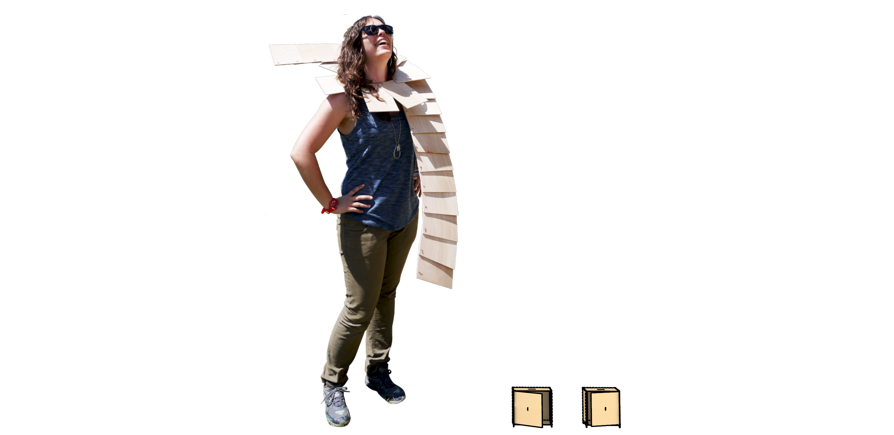

# CoinBankSafe

Pattern for laser cutting generated from: https://boxes.hackerspace-bamberg.de/CoinBankSafe?language=en

## To do

### ✅ Generate version of laser cutting patterns that would fit the material we have (plywood 60x30 cm)
- [130x130x130 mm](https://discord.com/channels/@me/1021124550336991404/1358405528551821494)
- [130x150x130 mm](https://discord.com/channels/@me/1021124550336991404/1358405528551821494)

### Prepare a graphic to decorate the safe

### Perform laser cutting and assembly